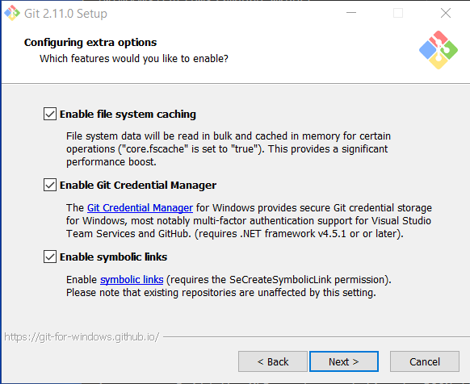
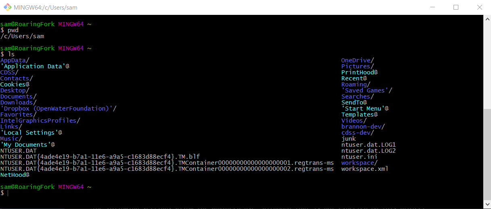

# Development Environment / Git #

Git software is used for version control and software developers are expected to follow Git best practices.

Git software must be installed and configured on the computer in order to use Git for version control.
The [Eclipse IDE](eclipse/), which is recommended as an option for interactive development, provides Git integration;
however, Git command line tools can also be used independent of Eclipse.
The Git tools described below are recommended, although developers may use other Git client software if they have preferences.
Many of the examples in this documentation use command line Git (Git Bash) for clarity.

The following resources are helpful:

* [Pro Git](https://git-scm.com/book/en/v2)
* [Dealing with line endings (GitHub)](https://help.github.com/articles/dealing-with-line-endings/)

This documentation includes the following sections:

* [Install Git](#install-git)
	+ [Linux](#linux)
	+ [Windows](#windows)
* [Configure Git](#configure-git)

## Install Git ##

### Linux ###

**TODO smalers 2016-12-31 Linux instructions will be added after Windows version is comlete.**

### Windows ###

Determine whether Git for Windows is installed by looking for Git in the ***Windows Start*** menu.
If it has previously been installed, then it does not need to be reinstalled.

The following is the installer for Git for Windows, which will install
the command-line Git Bash shell and interactive Git GUI.

* [Git for Windows Download](https://git-for-windows.github.io/) - 64-bit Windows installer

Run the installer.


Research indicates that although it may be possible to install Git software in another folder,
installing under the user files may be the only option, so use the default.


The following setting is recommended and will require using Git Bash or Git GUI from the ***Windows Start*** menu.


The following setting ensures that text files in the Git repository will end with LF character and allow
files on the file system to use normal Windows CRLF characters.
This facilitates collaboration between developers on different operating systems.


The following setting provides better behavior when using Git Bash.


The following settings allow for advanced use, although that is not expected on this project.



Do not use experimental features.


Press ***Install*** to install.
Verify that a Git Bash window will display by using the ***Start / Git / Git Bash*** menu.
A window similar to the following should display.
Note that the title indicates that Git Bash uses a MinGW environment, although this MinGW is separate software
files from the MinGW used with the compilers.
The Git Bash title icon is distinctive and can be used to differentiate from other Bash/MinGW environments, such as Cygwin
(not covered in this documentation) and the MinGW environment used for compiling Fortran (covered in this documentation).



## Configure Git ##

See [Git Pro / Getting Started / First-Time Git Setup](https://git-scm.com/book/en/v2/Getting-Started-First-Time-Git-Setup).

The default git global configuration may be fine for most settings.
However, a few settings need to be set at a minimum, as follows.
Note that these configuration steps generally need to be performed for each major Git software installation because
the Git tools may not share configuration files.
**TODO smalers 2016-12-04 Need to understand where Eclipse Git configuration is stored and document.**

Set the Git user name.  This is typically the same name that is used as the GitHub account.

Do the following in Git Bash.

```bash
$ git config --global user.name "First Last"
```

Set the email that should be used for the user, typically the company email if software development is done at work:

```bash
$ git config --global user.email "first.last@some.domain"
```

Set the editor to use when editing commit messages, etc. (replace `vim` with desired editor program,
specifying a program found in the `PATH` or provide the full path):

```bash
$ git config --global core.editor vim
```

To list the configuration, including settings stored in user's configuration file:

```bash
$ git config --list
```

Although it is possible to set other global parameters, the defaults are recommended in most cases,
in particular because the install process set properties to handle text file end of line.
See the next section for issues to be aware of.

Git commands that interact with the remote repository will prompt for authentication.
This can be inefficient and irritating.  The Git for Windows installer turns on a feature to cache the credentials.

## Git Issues to be Aware of ##

The following are important to keep in mind:

* If you do not feel comfortable with Git, spend time on online training and talk to other developers.
Understanding branches, merging, and overall Git workflow is important.  A helpful free online tutorial is
[Udacity: How to Use Git and GitHub](https://www.udacity.com/course/how-to-use-git-and-github--ud775) and
the [CDSS Learn Git](http://learn.openwaterfoundation.org/cdss-learn-git/index.html)
provides general learning resources.

* Text file end-of-line characters can be a problem because they are different on different operating systems.
A `.gitattributes` file has been created for the project to enforce end-of-line handling in the repository.

* Do not commit dynamic files to the repository that can be recreated from source.
Examples are compiled object files, libraries, and executables, and test results.
Use `.gitignore` files at the top level and strategically within folders, as appropriate.
Initial `.gitignore` files are generally added to the Git repository by the maintainers of the repository.

* Avoid relying on global Git configuration per each developer (`git config` command) because this is prone to inconsistency.
Instead, rely on `.gitattributes` and other repository-stored configuration files that persist across developers.
