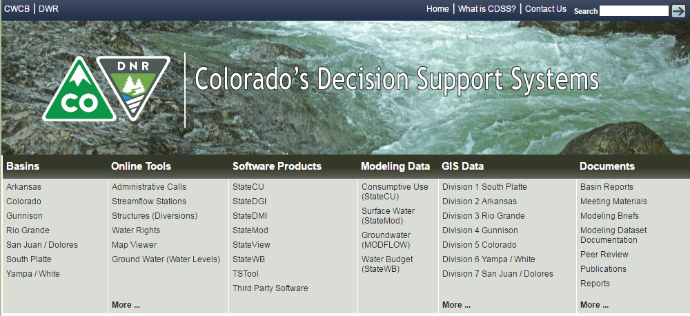

# Learn StateCU (for Software Developers)

This documentation is the developer manual for Colorado's Decision Support Systems (CDSS) StateCU consumptive use model software.

**This documentation is a work in progress and will contain notes for inserts until resources can
be devoted to filling in blanks.  Comments in the code with text "TODO smalers 2017-01-01 some text" (for example)
are included to indicate work that needs to be completed.**

If you are reading this documentation, you have an interest in learning how StateCU is designed,
are a member of the software development team,
or perhaps wish to contribute software code enhancements or otherwise provide input to the project.
This documentation is intended to provide sufficient information to software developers
to streamline understanding of the StateCU code and developer environment.
It is expected that software developers are technically competant and
follow conventions of the open source StateCU project.
>_[JHB] I like this opening paragraph. perhaps use __"facilitate"__ instead of __"streamline"__ or else "streamline __the process of__ understanding the StateCU code ..."_

>_[JHB] I like the high level organizational design.  It felt overwhelming at first (complicated), but after living with it a while, it makes sense, and the consistency is wonderful._

>_[JHB] And I really like the way you organized and designed this documentation "system" that surrounds the code.  Without too much work, I am able to fork the documentation git repo, and make edits like this in a branch.  And using Markdown with mkdocs is great - never used it before, but only after a couple of hours I am already using "mkdocs serve" so I can watch my edits appear realtime in a browser window while I edit in Sublime in Ubuntu Linux on my notebook computer.  NICE!_

>_[JHB] My approach: the questions and requests for additional information and perspective through out the documents are appropriate and well thought out.  But on the first pass through all this, I struggled both with chasing technical details down rabbit holes (time sinks), and with adding reliable information that could be written extemporaneously from memory.  It has been too many years since I worked with the StateCU code.  So on a second pass through this, I'll keep at a high level and leave notes in this git branch (jim_comments).  Then I'll come back later for more work where needed._

This documentation page includes the following sections:__

* [Colorado'__s Decision Support Systems](#colorad-decision-support-systems) - the system under which the software is maintained
* [Open Water Foundation](#open-water-foundation) - lead organization for moving StateCU to open source project
* [How to Use this Documentation](#how-to-use-this-documentation) - guidance and list of main documentation sections
* [License](#license) - license for software and this documentation
* [Source Repository on GitHub](#source-repository-on-github) - location of StateCU repository in GitHub
* [MkDocs](#mkdocs) - the tool used to create this documentation

## Colorado's Decision Support Systems

Colorado's Decision Support Systems ([CDSS, cdss.state.co.us](http://cdss.state.co.us))
has been developed to answer important questions about Colorado's water resources.
CDSS efforts are led by the [Colorado Water Conservation Board (CWCB)](http://cwcb.state.co.us)
and [Colorado Division of Water Resources (DWR)](http://water.state.co.us).

One component of CDSS is the StateCU consumptive use model, which estimates irrigation water requirements and other demands.
>_[JHB] ...using one of multiple available standard engineering methods.  It was originally (1980's) coded in FORTRAN, and later a Windows PC GUI was added using VB6._

StateCU results are usfd as input to the StateMod water allocation model.

>_[JHB] ...are frequently used as part of a water resources or water rights analysis, and can also be used as an input to other engineering models, such as the CDSS StateMod..._

In late 2016, the Open Water Foundation began the effort to move StateCU and other CDSS software to open source licensing
and establish open source software projects, referred to as "OpenCDSS", and this documentation is one project outcome.

## Open Water Foundation

The Open Water Foundation (OWF, [openwaterfoundation.org](http://openwaterfoundation.org)) is a 501(c)3 social enterprise
nonprofit that focuses on developing and supporting open source software to make better
decisions about water resources.  OWF is providing technical resources and management to
transition StateCU and other CDSS software to a sustainable open source project.

See also other [OWF learning resources](http://learn.openwaterfoundation.org).

## How to Use this Documentation

This website is a companion to the StateCU source code and is the source of
information for software developers that modify and support StateCU.

The documentation is organized for new developers and existing developers.
The reference sections at the end explain initial development environment and project setup steps that were completed chronologically
and are useful as a reference to explain.  Specific setup steps are referenced as needed.

* [Deployed Environment](deployed-env/overview/) - describes the deployed environment after software is installed
* [New Developer Setup](dev-new/overview/) - **new StateCU software developers should start here**
* [Software Design](software-design/overview/) - provides details about the software code design
* [Development Tasks](dev-tasks/overview/) - describes comment development tasks - **refer to this after new development environment is configured**
* [REFERENCE: Development Environment](dev-env/overview/) - describes development environment software installation (some tools are shared between CDSS software projects)
* [REFERENCE: Initial Project Setup](project-init/overview/) - describes how the StateCU software project was initially configured

## License

The license for this documentation is being determined in the CDSS open source project.
More information will be provided later.

**TODO smalers 2017-01-09 need to determine softare and documentation license.**

## Source Repository on GitHub

**TODO smalers 2016-12-31 this information will be finalized once the public code repository and open source project website is put into place.**

The source files for this documentation are maintained in the private GitHub repository for StateCU: [cdss-app-statecu-fortran](https://github.com/OpenWaterFoundation/cdss-app-statecu-fortran) in the `doc-dev-mkdocs-project` folder.
These files are copied to the Open Water Foundation [Learn StateCU (for Software Developers)](http://learn.openwaterfoundation.org/owf-learn-cdss-statecu-dev/index.html) website.

## MkDocs

This documentation is prepared using MkDocs.
For full MkDocs documentation visit [mkdocs.org](http://mkdocs.org).
