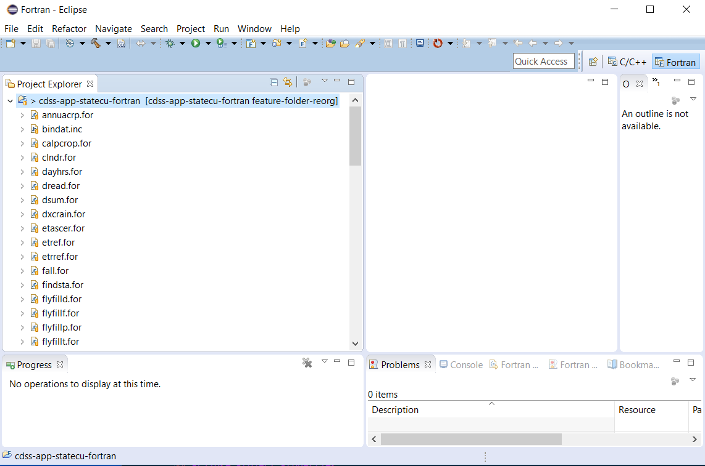
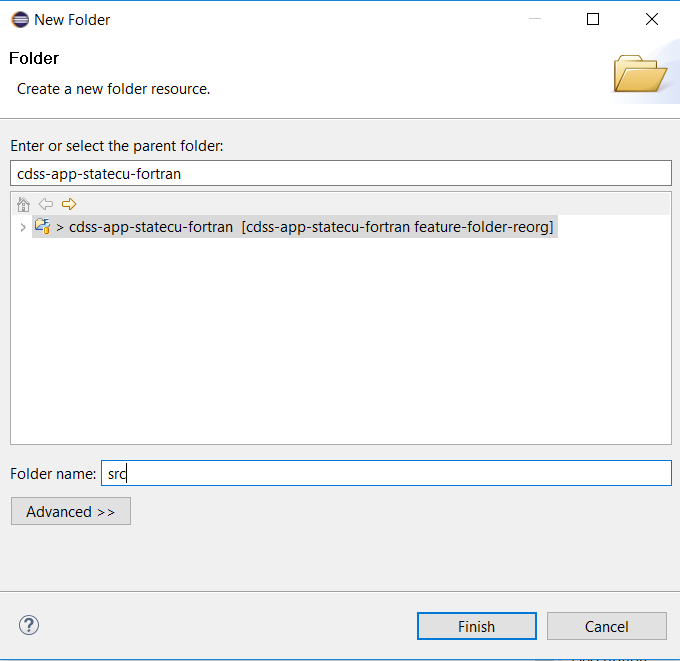
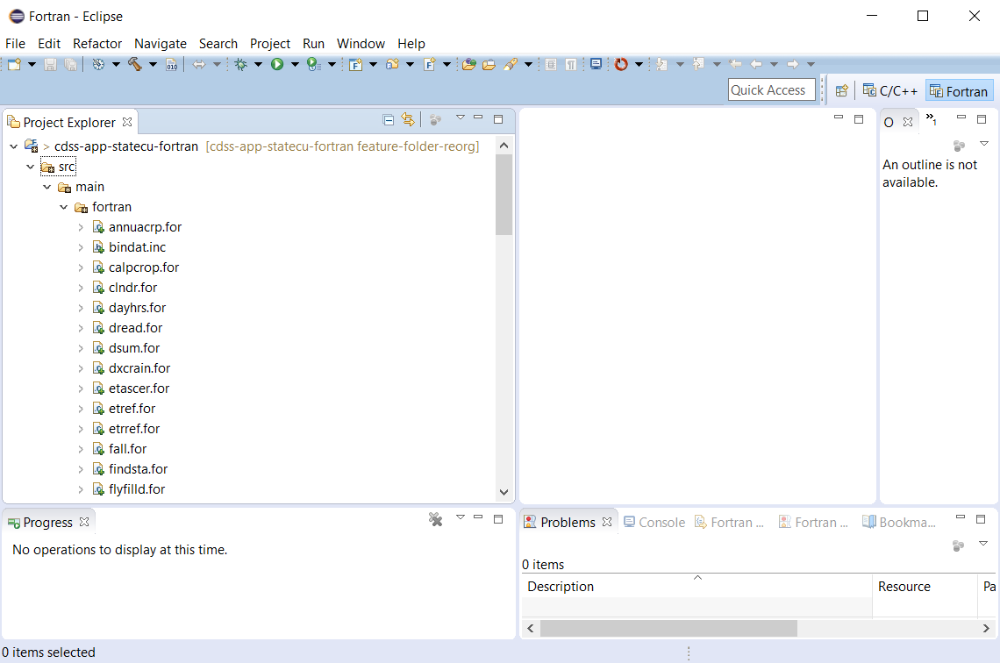

# Initial Project Setup / Eclipse Folder Structure

The legacy Git repository for StateCU code contained only a top-level folder with code files.
This facilitates basic use but is not consistent with a more formal development environment needed for OpenCDSS
and multiple collaborators.
Consequently, it is necessary to restructure the initial files, as described below.
Helpful information is:

* [Development folder structure](overview#development-folder-structure) - development folder structure for StateCU file
* [Maven Java Standard Directory Layout](https://maven.apache.org/guides/introduction/introduction-to-the-standard-directory-layout.html) - useful example for Java code

This documentation includes the following sections:

* [Reorganize Code into Development Folder Structure](#reorganize-code-into-development-folder-structure)
* [Rename Makefile](#rename-makefile)
* [Rename README](#rename-readme)
* [Add Standard Git Repository Files](#add-standard-git-repository-files) 
* [Next Steps](#next-steps)

-------------------

## Reorganize Code into Development Folder Structure

The initial folder structure is as shown below:

The flat structure of the legacy files are reorganized into the new [development folder structure](overview#development-folder-structure)
as follows.

First, right click on the project in ***Project Explorer*** and then use ***New / Folder*** to create a `src` folder
for the source code.  The `src` folder will be present in the repository folder (but note that `git status` does not list empty folders).

Create additional folders under `src` to match the development files structure and use the Eclipse drag-and-drop features to move files around.

The final result is as follows

## Rename Makefile

The legacy files used a makefile named `makefile_eclipse_linux` and there is no other makefile present.
Because the default build command is `make` which relies on a default makefile name of `makefile`,
and because the general makefile will be updated to work with `gfortran` consistently across operating systems,
rename the `makefile_eclipse_linux` file to `makefile`.
This will support actions later in the documentation.

## Rename README

The legacy README file was a simple text file, but with no file extension.
Consistent with GitHub, rename to `README.md` and add Markdown text explaining the repository.

## Add Standard Git Repository Files

A Git repository generally includes several standard files at the top level to configure the repository.
The legacy repository did not include these files so they have been added, as described below.

### `README.md`

The `README.md` file is a standard file to describe the repository.

### `.gitignore`

The `.gitignore` file is used to globally ignore certain files, such as products of compiling code,
which should not be saved to the repository because they are dynamic files that can be recreated.

Note that a `.gitignore` file can be created in any repository folder to provide more fine-grained control
over ignored files.

A `.gitignore` file (or a `README.md`) can also be used to ensure that an empty file is not deleted.
If used for this purpose and no other files in the folder are committed to the reposiotry,
add `!.gitignore` to ensure that the file itself is not ignored.

### `.gitattributes`

The `.gitattributes` file indicates repository properties.
This is a newer Git feature that allows settings to travel with the repository rather than depending
on individual software developer environment configuration.
In particular the `* text=auto` notation is used to control how end-of-line characters are handled.

See the GitHub article [Dealing with line endings](https://help.github.com/articles/dealing-with-line-endings/).

### `LICENSE.md`

The license file indicates the software license.  GPL v3 is used for OpenCDSS software.

## Next Steps

The next steps are to make some additional changes to the project to enable compiling the software.
