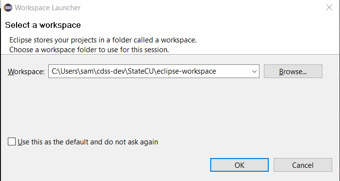
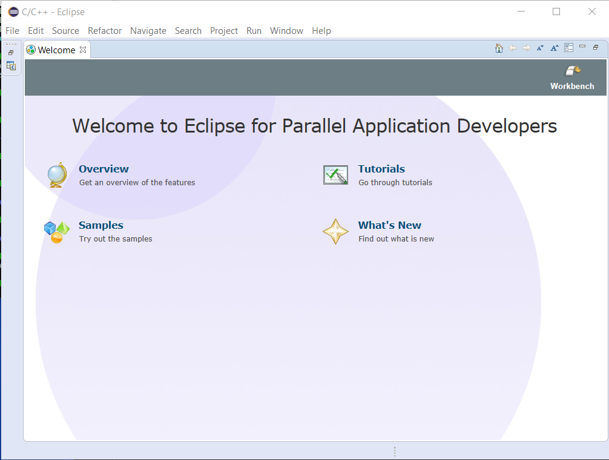

# Initial Project Setup / Eclipse Workspace

The Eclipse workspace folder should be created as per
the [development folder structure](overview#development-folder-structure):

* Linux: `~/cdss-dev/StateCU/eclipse-workspace`
* Windows: `C:\Users\user\cdss-dev\StateCU\eclipse-workspace`

Note that if Eclipse is not the IDE that is used (future consideration), then this discussion still applies in concept.

The following sections are included in this documentation:

* [Prerequisites](#prerequisites)
* [Background](#background)
* [Create Eclipse Workspace Folder](#create-eclipse-workspace-folder)
* [Specify Eclipse Workspace Folder to Eclipse](#specify-eclipse-workspace-folder-to-eclipse)
* [Workspace Configuration](#workspace-configuration)
* [Next Step](#next-step)

--------------

## Prerequisites

Creating an Eclipse workspace requires that Eclipse is installed and it is recommended that Eclipse
is run using an [Eclipse run script](eclipse-run-script/).

## Background

An Eclipse workspace contains numerous files including:

1. `.metadata` folder containing the files in the workspace, in particular the list of projects, which are in:
`.metadata/plugins/org.eclipse.core.resources/.projects`.
Each project has a folder with name matching the eclipse project name and under that is a `.location` file that
indicates the location of the project files on the file system (will match repository after configuration).
2. Plugin files that contain dynamic content generated during the Eclipse session.

Although it is possible to create one workspace and manage multiple development efforts
(e.g., StateCU and additional software) under one workspace,
this can become confusing.
The following assumes that a new workspace is created specifically for the StateCU project
consistent with the [development project folder structure](overview#development-folder-structure).

## Create Eclipse Workspace Folder

The Eclipse workspace folder can be created through the Eclipse workspace selection wizard (see next section) but can
also be created as follows and then selected in Eclipse.
It is assumed that the parent folders were created in previous steps.

### Linux

```bash
$ cd ~/cdss-dev/StateCU
$ mkdir eclipse-workspace
```

### Windows

```com
> C:
> cd \Users\user\cdss-dev\StateCU
```

## Specify Eclipse Workspace Folder to Eclipse

Start Eclipse using the [run script](eclipse-run-script/)
and select the workspace folder created in the previous step, for example for software developer "sam":



Pressing ***OK*** will create the `.metadata` folder in the workspace folder, under which are many files for plugins and
to manage project files.  The following blank workspace will be shown:



The welcome tab can be closed to reveal the normal interface.

**Workspace files will not be committed to the Git repository because they are large, dynamic, and can vary by
developer.**  If workspace files were committed to the repository, then developers could undo each other's workspace configuration on a regular basis.
For this reason, it is important to NOT store Eclipse project files under the workspace folder.
Instead, the files in the git repository folder will be linked to the workspace in a later step.

## Workspace Configuration

Additional configuration of the workspace may be desirable.
This will be evaluated as Eclipse is used in development.

## Next Step

See the configuration of the [Eclipse StateCU Project](eclipse-statecu-project).
